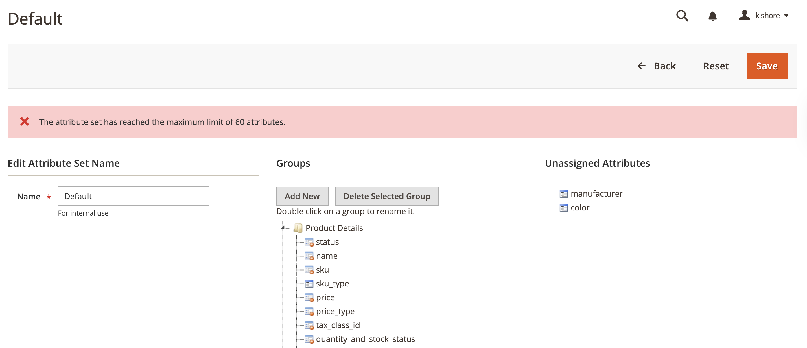

# Magekwik Attribute Set Limit for Magento 2

[](https://github.com/kmyprojects/Magento-2-Attribute-Set-Limit)

[](https://opensource.org/licenses/OSL-3.0)


## Overview

The **Magekwik Attribute Set Limit** module for Magento 2 enforces a maximum limit of 500 attributes per product attribute set. It prevents additional attributes from being assigned via the admin panel or API once the limit is reached, ensuring optimal performance and maintainability of attribute sets in large-scale Magento installations.

This module is designed for Magento 2 certified developers and store administrators who need to enforce strict governance over product attribute sets to prevent excessive complexity.

## Features

- Enforces a configurable limit of 500 attributes per product attribute set.
- Blocks attribute additions via admin panel (Stores > Attributes > Attribute Set) and API calls.
- Provides clear error messages when the limit is exceeded.
- Compatible with Magento Open Source and Adobe Commerce (2.4.x and later).

## Installation

### Via Composer (Recommended)

1. Add the module to your Magento project:
   ```bash
   composer require magekwik/attribute-set-limit
   ```

2. Enable the module and update the Magento setup:
   ```bash
   bin/magento module:enable Magekwik_AttributeSetLimit
   bin/magento setup:upgrade
   bin/magento cache:flush
   ```

### Manual Installation

1. Clone or download the repository to `app/code/Magekwik/AttributeSetLimit`.
2. Run the following commands:
   ```bash
   bin/magento module:enable Magekwik_AttributeSetLimit
   bin/magento setup:upgrade
   bin/magento cache:flush
   ```

## Usage

Once installed, the module automatically enforces a limit of 500 attributes per product attribute set. When attempting to add attributes beyond this limit via the admin panel or API, an error message will be displayed:

> The attribute set cannot exceed 500 attributes.

### Admin Panel

Navigate to **Stores > Attributes > Attribute Set** and edit an attribute set. The module checks the total number of attributes during save operations and prevents saving if the limit is exceeded. (in example we have used 60 as limit in Configuration Section)



### API

When using the Magento API to assign attributes to a product attribute set (e.g., via `Magento\Eav\Api\AttributeManagementInterface`), the module will throw a `LocalizedException` if the limit is reached.

## Configuration

The attribute limit is set to 500 by default and can be modified by updating the `MAX_ATTRIBUTES_PER_SET` constant in the following files:
- `Plugin/AttributeManagementPlugin.php`
- `Plugin/AttributeSetPlugin.php`

Ensure both constants are updated to maintain consistency.

## Debugging

To verify the number of attributes in an attribute set:
- **Database Query**: Run `SELECT COUNT(*) FROM eav_entity_attribute WHERE attribute_set_id = <your_set_id>;`.
- **Admin Panel**: Manually count attributes in the attribute set edit page.
- **Logging**: Enable logging in `Plugin/AttributeSetPlugin.php` by injecting `\Psr\Log\LoggerInterface` and logging `$totalAttributes`.

## Compatibility

- Magento Open Source: 2.4.x
- Adobe Commerce: 2.4.x
- PHP: 7.4, 8.0, 8.1

## Support

For issues, feature requests, or contributions, please visit the [GitHub repository](https://github.com/kmyprojects/Magento-2-Attribute-Set-Limit) or create an issue.

## License

This module is licensed under the [Open Software License 3.0 (OSL-3.0)](https://opensource.org/licenses/OSL-3.0).

## Author

Developed by Kanaka Kishore Kandregula, a Magento 2 Certified Developer with over 10 years of experience in e-commerce solutions.

---
*Built for performance, reliability, and scalability.*
